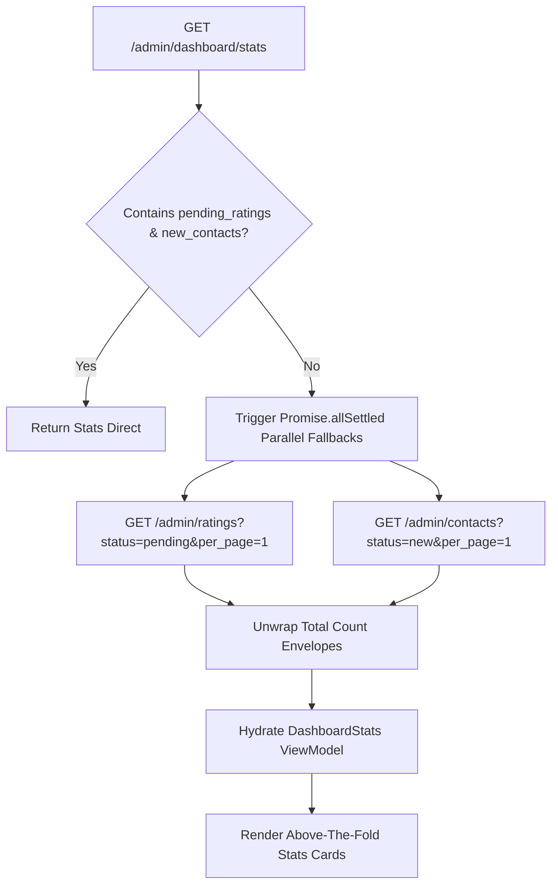

# Data Integration Plan - Admin Dashboard

Detailed data integration plan for the **Admin Dashboard** (`admin-dashboard`) in the `danangtrip-admin` repository. This document maps out the query architecture, data normalization mappers, resilient API fallbacks, Excel export mutations, and state boundaries.

- **Feature Slug:** `admin-dashboard`
- **Primary Page Component:** [Dashboard/index.tsx](file:///D:/DATN/danangtrip-admin/src/pages/Dashboard/index.tsx)
- **Data Layer Hook:** [useDashboardQueries.ts](file:///D:/DATN/danangtrip-admin/src/hooks/useDashboardQueries.ts)
- **Date Created:** 2026-05-21

---

## 1. Overview of Data Architecture

The Admin Dashboard implements a **decoupled, parallel multi-query architecture** utilizing `@tanstack/react-query` (TanStack Query v5). Instead of wrapping requests in a singular, blocking monolithic promise waterfall, each graphical widget and statistical counter query is triggered independently. 

### Core Benefits
*   **Zero Waterfall Blocking:** A delay or bottleneck in loading historical revenue charts does not delay above-the-fold counter rendering.
*   **Contextual Skeletons:** Skeletons apply per widget based on separate `isLoading` properties.
*   **Granular Refetching:** Refresh buttons target individual refetch queries, reducing unnecessary network load.

---

## 2. Parallel Query Directory

All endpoints require JWT authorization tokens passed transparently via the standard `axiosClient` interceptors.

| Hook Name | Target API Route | TanStack Query Key | Cache Stale Time | Query Parameters |
|---|---|---|---|---|
| `useDashboardStatsQuery` | `GET /admin/dashboard/stats` | `['dashboard', 'stats']` | `5 minutes` | *None* |
| `useBookingStatusCountsQuery` | `GET /admin/bookings/status-counts` | `['dashboard', 'bookingStatusCounts', params]` | `30 seconds` | Optional status filters. |
| `useRevenueQuery` | `GET /admin/dashboard/revenue` | `['dashboard', 'revenue', params]` | `2 minutes` | `period` (day/week/month/year), `from`, `to`. |
| `useBookingTrendQuery` | `GET /admin/dashboard/booking-trend` | `['dashboard', 'bookingTrend', params]` | `2 minutes` | `days` (7, 30, 90). |
| `useUserGrowthQuery` | `GET /admin/dashboard/user-growth` | `['dashboard', 'userGrowth', params]` | `10 minutes` | `year` (number). |
| `useTopToursQuery` | `GET /admin/dashboard/top-tours` | `['dashboard', 'topTours', params]` | `5 minutes` | `limit`, `from`, `to`. |
| `useBookingsQuery` | `GET /admin/bookings` | `['dashboard', 'bookings', params]` | `30 seconds` | `page`, `per_page`, `sort_by`, `sort_order`, `booking_status`. |

---

## 3. Resilient Fallback Engine

If the core counters API `/admin/dashboard/stats` does not return `pending_ratings` or `new_contacts` (due to database shape changes or legacy backend versions), the `useDashboardStatsQuery` invokes the `resolveStatsWithFallback` engine to pull these details in parallel:



### Unwrapping Response Envelopes
To handle diverse backend payload paginations, the fallback extraction method safely maps:
1.  Direct envelope unwrapping: `data.total`
2.  Meta envelope extraction: `data.meta.total`
3.  Pagination envelope extraction: `data.pagination.total`
4.  If a request fails or is rejected, it falls back gracefully to `0` without throwing full-page runtime exceptions.

---

## 4. Excel Report Export Mutation (`useBookingsExportMutation`)

*   **Hook Type:** `useMutation`
*   **Trigger:** Client clicks "Xuất báo cáo" (Export Excel).
*   **Execution Flow:**
    1.  The mutation is fired with date bounds: `from_date` and `to_date`.
    2.  Invokes `GET /admin/bookings/export` requesting `{ responseType: 'blob' }`.
    3.  Passes response to `prepareSpreadsheetDownload` utility, resolving standard content-disposition envelopes.
    4.  Extracts spreadsheet Blob.
    5.  Triggers `downloadBlobFile` injecting the generated file into the native browser download queue.
    6.  Triggers a success `sonner` toast (`t('tables.export_success')`) or error toast on failure.

---

## 5. Cross-Module Cache Invalidation Framework

Since the dashboard summarizes transaction status, revenue, and bookings, operations executed on other administrative pages must trigger invalidations to keep dashboard aggregates up-to-date.

```
Adjacent Page Event                         Invalidation Action
┌─────────────────────────────┐             ┌──────────────────────────────────────┐
│  Bookings Detail:           │             │  queryClient.invalidateQueries({     │
│  - Confirm/Cancel Bookings  │────────────>│    queryKey: ['dashboard']           │
│  - Edit seat counts         │             │  })                                  │
└─────────────────────────────┘             └──────────────────────────────────────┘
┌─────────────────────────────┐                                ▲
│  Payments Detail:           │                                │
│  - Process Refund           │────────────────────────────────┘
│  - Audit Payments           │
└─────────────────────────────┘
```

By invalidating the root query key prefix `['dashboard']`, TanStack Query will flag all active queries (stats, statuses, trends, top tours) as stale. The dashboard page will then execute a clean background refetch of active widgets without forcing full-page re-renders.

---

## 6. Verification & Compilation Check

All service connectors and query hook structures are verified to compile flawlessly:
*   [x] Standard query keys (`dashboardKeys.all`) are correctly defined in `useDashboardQueries.ts`.
*   [x] Data Normalization Mappers mapping Raw to ViewModel representations are correctly registered inside `dashboard.mapper.ts`.
*   [x] Background refetch and global refresh (`handleRefresh`) in `index.tsx` successfully trigger invalidation on the root prefix key, keeping all dependent components in sync.
