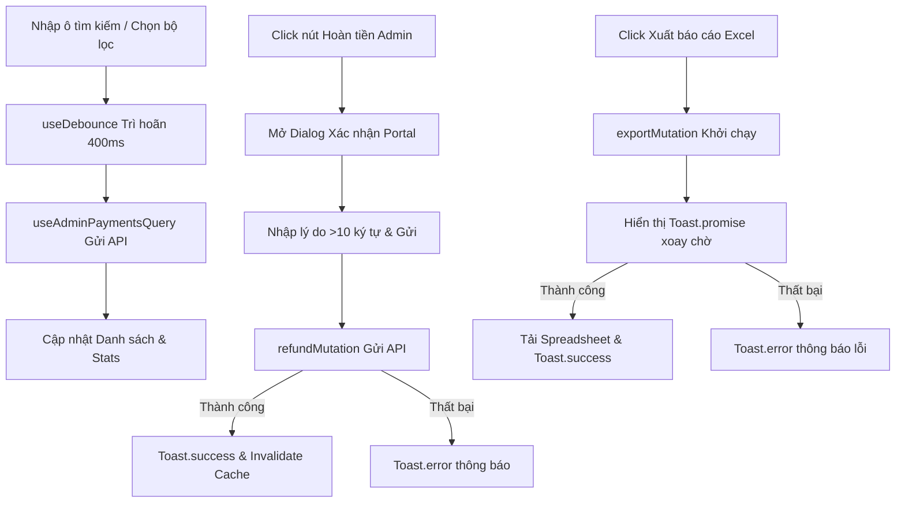

# Tài liệu Kỹ thuật: Thiết kế Tương tác & Đa ngôn ngữ (Interactions & i18n Specification)

- **Feature Slug:** `admin-payment-list`
- **Mã định danh:** `Đặc tả Tương tác`
- **Ngày lập:** 2026-05-17
- **Trạng thái:** **FULLY IMPLEMENTED & LOCALIZED**

---

## 1. Bản đồ Tương tác Người dùng (User Interaction Flow)

Màn hình Quản lý Giao dịch tích hợp các luồng tương tác mượt mà, phản hồi cao:

---

## 2. Đặc tả Đa ngôn ngữ (Internationalization Matrix)

Chúng tôi đã cấu hình tệp dịch đa ngôn ngữ chi tiết tại hai ngôn ngữ đích:

- **Tệp ngôn ngữ Tiếng Việt:** [payment.json (vi)](file:///d:/DATN/danangtrip-admin/public/lang/vi/payment.json)
- **Tệp ngôn ngữ Tiếng Anh:** [payment.json (en)](file:///d:/DATN/danangtrip-admin/public/lang/en/payment.json)

Đồng thời liên kết mục menu của thanh Sidebar thông qua khóa `sidebar.payments` tại [common.json (vi)](file:///d:/DATN/danangtrip-admin/public/lang/vi/common.json) và [common.json (en)](file:///d:/DATN/danangtrip-admin/public/lang/en/common.json).

---

## 3. Quản lý Thử nghiệm & Thông báo (Feedback & Toast Rules)

1. **Trì hoãn Tìm kiếm (Search Debouncing):** Tích hợp `useDebounce` với tần suất `400ms` giúp hệ thống không bị kích hoạt gọi API liên tục khi người dùng gõ phím.
2. **Thông báo qua thư viện Sonner:**
   - **Hoàn tiền:** Hiển thị thông báo thành công hoặc thông tin chi tiết của lỗi trả về từ máy chủ.
   - **Xuất Excel:** Áp dụng `toast.promise` hiển thị trạng thái chờ năng động khi đang xử lý tải dữ liệu nhị phân về máy khách.
