# Báo cáo Bàn giao: Tính năng Quản lý Giao dịch (Admin Payments List)

- **Feature Slug:** `admin-payment-list`
- **Mã định danh:** `Walkthrough`
- **Ngày hoàn tất:** 2026-05-17
- **Người thực hiện:** **Antigravity (AI Pair Programmer)**
- **Kết quả nghiệm thu:** **100% HOÀN TẤT & KHÔNG CÓ LỖI (ZERO ERRORS)**

---

## 1. Bản đồ Hành trình 10 Kỹ năng (10-Skill Pipeline Journey)

Chúng tôi đã hoàn thành toàn bộ hành trình triển khai tính năng theo quy chuẩn kỹ thuật đỉnh cao:

```mermaid
graph LR
    S1[01. Phân tích] --> S2[02. Setup Audit]
    S2 --> S3[03. Types & API]
    S3 --> S4[04. Route & Layout]
    S4 --> S5[05. UI Components]
    S5 --> S6[06. Data Integration]
    S6 --> S7[07. Interactions & i18n]
    S7 --> S8[08. Auth & Gate]
    S8 --> S9[09. Testing Verification]
    S9 --> S10[10. Optimize & Deploy]
```

---

## 2. Các thay đổi và Tác phẩm Kỹ thuật (Technical Deliverables)

### 2.1 Thành phần Mã nguồn & Giao diện (Source Files Created/Modified)

1. **API Client & Mappers:**
   - [payment.dataHelper.ts](file:///d:/DATN/danangtrip-admin/src/dataHelper/payment.dataHelper.ts): Thiết lập kiểu dữ liệu View Models & Filters.
   - [payment.mapper.ts](file:///d:/DATN/danangtrip-admin/src/dataHelper/payment.mapper.ts): Chuyển đổi dữ liệu thô từ Backend thành kiểu View Model thống nhất.
   - [paymentApi.ts](file:///d:/DATN/danangtrip-admin/src/api/paymentApi.ts): Định nghĩa các phương thức gọi mạng HTTP RESTful.
2. **Layout & Routes:**
   - Đăng ký hằng số tuyến đường `ROUTES.PAYMENTS_LIST` tại [routes.ts](file:///d:/DATN/danangtrip-admin/src/routes/routes.ts).
   - Lazy load thành phần trang tại [routes/index.tsx](file:///d:/DATN/danangtrip-admin/src/routes/index.tsx).
   - Thêm nút quản lý giao dịch vào thanh Sidebar tại [Sidebar.tsx](file:///d:/DATN/danangtrip-admin/src/components/layout/Sidebar.tsx).
3. **Thành phần UI & Trải nghiệm tương tác:**
   - [PaymentStatsRow.tsx](file:///d:/DATN/danangtrip-admin/src/pages/Payments/PaymentList/components/PaymentStatsRow.tsx): Hàng thống kê tổng quan doanh thu và số lượng.
   - [PaymentFilterBar.tsx](file:///d:/DATN/danangtrip-admin/src/pages/Payments/PaymentList/components/PaymentFilterBar.tsx): Bộ lọc nâng cao tiện ích.
   - [PaymentTable.tsx](file:///d:/DATN/danangtrip-admin/src/pages/Payments/PaymentList/components/PaymentTable.tsx): Bảng phân trang dữ liệu hoàn chỉnh.
   - [RefundPaymentDialog.tsx](file:///d:/DATN/danangtrip-admin/src/pages/Payments/PaymentList/components/RefundPaymentDialog.tsx): Hộp thoại xác nhận hoàn tiền portal bảo mật.
4. **Tích hợp Dữ liệu & Đa ngôn ngữ:**
   - [usePaymentQueries.ts](file:///d:/DATN/danangtrip-admin/src/hooks/usePaymentQueries.ts): React Query hooks tích hợp cache quản lý `paymentKeys`.
   - Xuất khẩu toàn bộ hooks tại [hooks/index.ts](file:///d:/DATN/danangtrip-admin/src/hooks/index.ts).
   - Tài nguyên dịch Tiếng Việt & Tiếng Anh tại [payment.json (vi)](file:///d:/DATN/danangtrip-admin/public/lang/vi/payment.json) and [payment.json (en)](file:///d:/DATN/danangtrip-admin/public/lang/en/payment.json).

---

## 3. Nhật ký Đánh giá Kỹ thuật (Technical Verification Log)

- **TypeScript Typecheck:** Đạt kết quả **100% biên dịch thành công (Exit Code: 0)**.
- **ESLint Code Quality:** Đạt kết quả **100% sạch sẽ chuẩn convention (Exit Code: 0)**.
- **Vite Bundler Production:** Đóng gói thành công toàn bộ dự án sang thư mục `dist/` mà không gặp bất kỳ lỗi import hay thiếu thư viện nào **(Exit Code: 0)**.

---

## 4. Danh sách Hồ sơ Kỹ thuật (Technical Specification Files)

Hệ thống tài liệu kỹ thuật chi tiết đã được bàn giao đầy đủ tại thư mục `.agent/artifacts/` của dự án:

1. **Phân tích giao diện:** [2026-05-17__admin-payment-list__screen-analysis.md](file:///d:/DATN/danangtrip-admin/.agent/artifacts/analysis/2026-05-17__admin-payment-list__screen-analysis.md)
2. **Kiểm tra Base:** [2026-05-17__project-base__project-audit.md](file:///d:/DATN/danangtrip-admin/.agent/artifacts/audit/2026-05-17__project-base__project-audit.md)
3. **API & Types Contract:** [2026-05-17__admin-payment-list__api-contract.md](file:///d:/DATN/danangtrip-admin/.agent/artifacts/contract/2026-05-17__admin-payment-list__api-contract.md)
4. **Kế hoạch Định tuyến:** [2026-05-17__admin-payment-list__route-plan.md](file:///d:/DATN/danangtrip-admin/.agent/artifacts/routing/2026-05-17__admin-payment-list__route-plan.md)
5. **Đặc tả UI & Aesthetics:** [2026-05-17__admin-payment-list__ui-spec.md](file:///d:/DATN/danangtrip-admin/.agent/artifacts/ui/2026-05-17__admin-payment-list__ui-spec.md)
6. **Tích hợp Dữ liệu:** [2026-05-17__admin-payment-list__data-integration.md](file:///d:/DATN/danangtrip-admin/.agent/artifacts/integration/2026-05-17__admin-payment-list__data-integration.md)
7. **Tương tác & Đa ngôn ngữ:** [2026-05-17__admin-payment-list__i18n-interactions.md](file:///d:/DATN/danangtrip-admin/.agent/artifacts/interactions/2026-05-17__admin-payment-list__i18n-interactions.md)
8. **Đánh giá Phân quyền:** [2026-05-17__admin-payment-list__auth-permissions-review.md](file:///d:/DATN/danangtrip-admin/.agent/artifacts/security/2026-05-17__admin-payment-list__auth-permissions-review.md)
9. **Báo cáo Kiểm thử:** [2026-05-17__admin-payment-list__test-report.md](file:///d:/DATN/danangtrip-admin/.agent/artifacts/testing/2026-05-17__admin-payment-list__test-report.md)
10. **Báo cáo Phát hành:** [2026-05-17__admin-payment-list__deploy-report.md](file:///d:/DATN/danangtrip-admin/.agent/artifacts/deploy/2026-05-17__admin-payment-list__deploy-report.md)
