# Báo cáo Bàn giao: Tính năng Báo cáo Đơn hàng (Admin Bookings Report)

- **Feature Slug:** `admin_reports_bookings`
- **Mã định danh:** `Walkthrough`
- **Ngày hoàn tất:** 2026-05-22
- **Người thực hiện:** **Antigravity (AI Pair Programmer)**
- **Kết quả nghiệm thu:** **100% HOÀN TẤT & XÁC THỰC BỞI PLAYWRIGHT (ZERO ERRORS)**

---

## 1. Bản đồ Hành trình 10 Kỹ năng (10-Skill Pipeline Journey)

Chúng tôi đã hoàn thành toàn bộ hành trình triển khai tính năng theo quy chuẩn kỹ thuật đỉnh cao:

```mermaid
graph LR
    S1[01. Phân tích] --> S2[02. Setup Audit]
    S2 --> S3[03. Types & API]
    S3 --> S4[04. Route & Layout]
    S4 --> S5[05. UI Components]
    S5 --> S6[06. Data Integration]
    S6 --> S7[07. Interactions & i18n]
    S7 --> S8[08. Auth & Gate]
    S8 --> S9[09. Testing Verification]
    S9 --> S10[10. Optimize & Deploy]
```

---

## 2. Các thay đổi và Tác phẩm Kỹ thuật (Technical Deliverables)

### 2.1 Thành phần Mã nguồn & Giao diện (Source Files Created/Modified)

1. **API Client & Mappers:**
   - [report.dataHelper.ts](file:///d:/DATN/danangtrip-admin/src/dataHelper/report.dataHelper.ts): Thiết lập kiểu dữ liệu View Models & Filters cho báo cáo đơn hàng và đánh giá.
   - [report.mapper.ts](file:///d:/DATN/danangtrip-admin/src/dataHelper/report.mapper.ts): Chuyển đổi dữ liệu thô từ Backend thành kiểu View Model thống nhất cho báo cáo đơn hàng và đánh giá.
   - [reportApi.ts](file:///d:/DATN/danangtrip-admin/src/api/reportApi.ts): Định nghĩa các phương thức gọi mạng HTTP RESTful lấy báo cáo doanh thu & đơn hàng.
2. **Layout & Routes:**
   - Đăng ký hằng số tuyến đường `ROUTES.REPORTS_BOOKINGS` tại [routes.ts](file:///d:/DATN/danangtrip-admin/src/routes/routes.ts).
   - Lazy load thành phần trang tại [routes/index.tsx](file:///d:/DATN/danangtrip-admin/src/routes/index.tsx).
   - Thêm nút báo cáo đơn hàng vào thanh Sidebar tại [Sidebar.tsx](file:///d:/DATN/danangtrip-admin/src/components/layout/Sidebar.tsx).
3. **Thành phần UI & Trải nghiệm tương tác:**
   - [BookingStatsCards.tsx](file:///d:/DATN/danangtrip-admin/src/pages/Reports/BookingsReport/components/BookingStatsCards.tsx): Hàng thống kê tổng quan doanh thu, số lượng đơn hàng kèm xu hướng tăng trưởng.
   - [ReportFilterBar.tsx](file:///d:/DATN/danangtrip-admin/src/pages/Reports/BookingsReport/components/ReportFilterBar.tsx): Bộ lọc nâng cao theo ngày bắt đầu, ngày kết thúc, trạng thái đơn và trạng thái thanh toán.
   - [BookingsReportCharts.tsx](file:///d:/DATN/danangtrip-admin/src/pages/Reports/BookingsReport/components/BookingsReportCharts.tsx): SVG Area Chart và Pie Chart hiển thị biểu đồ xu hướng doanh thu và trạng thái đơn hàng trực quan.
   - [BookingsReportTable.tsx](file:///d:/DATN/danangtrip-admin/src/pages/Reports/BookingsReport/components/BookingsReportTable.tsx): Bảng phân trang dữ liệu đơn hàng chi tiết.
4. **Tích hợp Dữ liệu & Đa ngôn ngữ:**
   - [useReportQueries.ts](file:///d:/DATN/danangtrip-admin/src/hooks/useReportQueries.ts): React Query hooks tích hợp cache quản lý `reportKeys`.
   - Tài nguyên dịch Tiếng Việt & Tiếng Anh tại [bookings_report.json (vi)](file:///d:/DATN/danangtrip-admin/public/lang/vi/bookings_report.json) và [bookings_report.json (en)](file:///d:/DATN/danangtrip-admin/public/lang/en/bookings_report.json).

---

## 3. Nhật ký Đánh giá Kỹ thuật (Technical Verification Log)

- **TypeScript Typecheck:** Đạt kết quả **100% biên dịch thành công (`tsc -b` Exit Code: 0)**.
- **ESLint Code Quality:** Đạt kết quả **100% sạch sẽ chuẩn convention (`eslint` Exit Code: 0)**.
- **Vite Bundler Production:** Đóng gói thành công toàn bộ dự án sang thư mục `dist/` chỉ trong **10.73 giây** without any issues.
- **Playwright E2E Automation:** Chạy thành công **100% các kịch bản kiểm thử tự động (`npm run test:console` & `npx playwright test tests/admin-reports-bookings.spec.ts`)** với **2/2 E2E test specs passed** & **4/4 console checks passed**.

---

## 4. Hồ sơ Bằng chứng (Screenshots & Evidence)

Toàn bộ ảnh chụp kiểm thử trực quan trên các độ phân giải khác nhau đã được ghi nhận:
- [bookings_report_desktop.png](file:///d:/DATN/danangtrip-admin/test-results/screenshots/bookings_report_desktop.png): Giao diện desktop glassmorphism sang trọng, biểu đồ Recharts vẽ chuẩn SVG.
- [bookings_report_tablet.png](file:///d:/DATN/danangtrip-admin/test-results/screenshots/bookings_report_tablet.png): KPI Stats Cards tự động thu gọn sang 2 cột, sidebar co giãn tối ưu.
- [bookings_report_mobile.png](file:///d:/DATN/danangtrip-admin/test-results/screenshots/bookings_report_mobile.png): Stacking dọc thông minh, bảng hỗ trợ vuốt ngang mượt màng.
- [bookings_report_english.png](file:///d:/DATN/danangtrip-admin/test-results/screenshots/bookings_report_english.png): Đồng bộ hóa ngôn ngữ Tiếng Anh 100% không sót key.
- Tải file thành công: `bao-cao-don-hang_2026-04-30_to_2026-05-22_2026-05-22.csv`.
